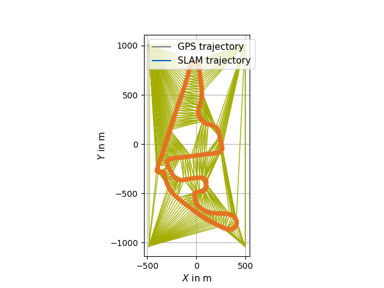

<div align="center">

<h1>FlexCloud</h1>

Georeferencing of Point Cloud Maps

[](https://www.linux.org/)
[](https://www.docker.com/)
[](https://docs.ros.org/en/humble/index.html)

</div>

<h2>Overview</h2>
This project enables the georeferencing of an existing point cloud map created only from inertial sensor data (e.g. LiDAR) by the use of the corresponding GNSS data.
Leveraging the concept of rubber-sheeting from 2D cartography, the tool is also able to account for accumulated errors during map creation and thus rectyfy the map.

<h2>🐋 Installation</h2>
1. Clone the repository by running
   ```bash
   git clone git@github.com:TUMFTM/FlexCloud.git
   ```
2. Go to the root directory of the repository
   ```bash
   cd FlexCloud/
   ```
3. Build the docker image
   ```bash
   ./docker/build_docker.sh  
   ```
4. Run the container and mount your data by appending the directory containing your data:
   ```bash
   ./docker/run_docker.sh /your/local/directory/data
   ```

Although installation with the provided Docker-Container is recommended, you can also install the package locally (e.g. if you have already install ROS2-Humble).
To do so, you first have to install the required dependencies:
* PCL
* CGAL
* GeographicLib
* Eigen3
If you are struggling with their installation, you can have a look at the process within the [Dockerfile](docker/Dockerfile).

<h2> 🔨 Usage</h2>

* set parameters in `/config/pcd_georef.param.yaml`

1. Necessary input parameters:
   - `traj_path` => path to GNSS/reference trajectory of the vehicle (format: txt-file with `lat, lon, ele, lat_stddev, lon_stddev, ele_stddev` or `x, y, z, x_stddev, y_stddev, z_stddev`, if the reference trajectory is already in local coordinates)
   - `poses_path` => path to SLAM trajectory of the vehicle (KITTI-format)
   - `pcd_path` => path to point cloud map corresponding to poses trajectory
   - `pcd_out_path` => path to save the final, georeferenced point cloud map (DEFAULT: /pcd_map_georef.pcd)

2. Start the package
   ```bash
       ros2 launch flexcloud pcd_georef.launch.py traj_path:=<path-to-ref-trajectory> poses_path:=<path-to-SLAM-trajectory>  pcd_path:=<path-to-pcd-map> pcd_out_path:=<path-to-save-pcd-map>
   ```
   To use the provided test data (only trajectories, no application on point cloud map -> set parameter `transform_pcd` to `false`)
   ```bash
   cd FlexCloud/
   ros2 launch flexcloud pcd_georef.launch.py traj_path:=test/poseData.txt poses_path:=test/poses_map.txt 
   ```

3. Optional: Select control points
   - if your reference trajectory and your SLAM trajectory are not time-synchronized, you can set the parameter `auto_cp` to `false` and select the control points for rubber-sheeting manually.
   - after the trajectories are loaded and the target trajectory is roughly aligned to the master trajectory you are asked in the command window to select control points for the rubber-sheet transformation (the amount of points can be configured in the config file).
   - select the desired points using the `Publish Point` button in RVIZ and follow the instructions in the console.

4. Inspect results
   - results of the rubber-sheet transformation & the resulting, transformed point cloud map are visualized in RVIZ.
   - adjust the parameters if the results are satisfying
   - see table for explanation of single topics
   - follow the instructions below (Content->Analysis) to get a quantitative evaluation fo the georeferencing
   - the results are automatically saved in the current working directory within the folder `output/traj_matching/`
   - Quick usage (the directory output/traj_matching is automatically generated at the current working directory):
   ```bash
       python3 plot_traj_matching.py /path/to/output/traj_matching/
   ```

| Topic | Description |
| ----------- | ----------- |
| `/tam/traj/traj_markers` | reference trajectory |
| `/tam/traj/traj_SLAM_markers` | original SLAM trajectory |
| `/tam/traj/traj_align_markers` | SLAM trajectory aligned to reference with [Umeyama](https://web.stanford.edu/class/cs273/refs/umeyama.pdf) transformation |
| `/tam/traj/traj_rs_markers` | SLAM trajectory after [rubber-sheet](https://www.tandfonline.com/doi/abs/10.1559/152304085783915135)-transformation |
| `/tam/rs/geom_markers_cps` | control points used for rubber-sheeting |
| `/tam/rs/geom_markers_triag` | triangulation used for rubber-sheeting |
| `/clicked_point` | last 2 selected points by user to indicate chosen control point |
| `/tam/rs/pcd_map` | transformed point cloud map |

   - Inspect results and modify parameters if desired.

<h2>📄 Content</h2>

Detailed documentation of the modules can be found below.

<details>
<summary> <h3> Trajectory Matching </h3> </summary>

- calculation of transformation based on GNSS/reference and SLAM trajectories
- trajectories do not have to be time-synchronized, although time-synchronization is required to select control points automatically for rubber-sheeting

<h4>1. Projection of Global Coordinates</h4>

- global coordinates may be projected into local coordinate system using ENU-coordinates from the [GeographicLib](https://geographiclib.sourceforge.io/2009-03/classGeographicLib_1_1LocalCartesian.html)
- origin of grid for projection set based on config file otherwise first GNSS point
- if the reference trajectory is already in a local, metric coordinate system, the projection may be skipped using the parameter `transform_traj`

<h4>2. Alignment of Trajectories by Rigid Transformation</h4>

- SLAM trajectory aligned to reference using [Umeyama algorithm](https://web.stanford.edu/class/cs273/refs/umeyama.pdf) transformation in 2D/3D
- application of calculated transformation on SLAM trajectory
- screenshot below shows results of alignment of SLAM trajectory to projected reference trajectory with [Umeyama algorithm](https://web.stanford.edu/class/cs273/refs/umeyama.pdf)\
  

<h4>3. Rubber-Sheet transformation</h4>

- piecewise linear rubber-sheet transformation in 2D/3D based on concept of [Griffin & White](https://www.tandfonline.com/doi/abs/10.1559/152304085783915135)
- using Delaunay triangulation from [CGAL](https://www.cgal.org/)
- manual selection of control points in RVIZ (see above) possible if trajectories are not time-synchronized (parameter `auto_cp`)
- automatic exclusion of trajectory points as control points using thresholding for standard deviation possible
- manual exclusion of indices as controlpoints and manual displacement in xy possible, see parameter descriptions
- application of calculated transformations on target SLAM-poses and point cloud map
- the two screenshots below show selected control points on the aligned trajectories from step 2 and the results of the rubber-sheet transformation\
   
</details>
<details>
<summary> <h3> Evaluation </h3> </summary>

- export of various data by setting corresponding parameters in config-file
  - data is exported to `.txt` files that are then read by python-scripts
  - set export path in config-file
  - adjust import paths at the beginning of python-scripts if necessary
- analysis scripts in `/analysis`:
   * visualization of initial trajectories, [Umeyama transformation](https://web.stanford.edu/class/cs273/refs/umeyama.pdf) and [Rubber-Sheet transformation](https://www.tandfonline.com/doi/abs/10.1559/152304085783915135)
   * execute script `plot_traj_matching.py` in `/analysis`
   * produces graphs shown in previous section
   * calculation of deviation between trajectories based on euclidean distance of points
</details>


<h2>📇 Contact Info </h2>

[Maximilian Leitenstern](mailto:maxi.leitenstern@tum.de),
Institute of Automotive Technology,
School of Engineering and Design,
Technical University of Munich,
85748 Garching,
Germany

<h2>📃 Additional Information </h2>
   
This tool forms a further development of the [FlexMap_Fusion](https://github.com/TUMFTM/FlexMap_Fusion)-package that focuses solely on the georeferencing of pointcloud map in 2D and 3D.
It follow the concepts presented with the publication [FlexMap Fusion: Georeferencing and Automated Conflation of HD Maps with OpenStreetMap](https://arxiv.org/abs/2404.10879)
