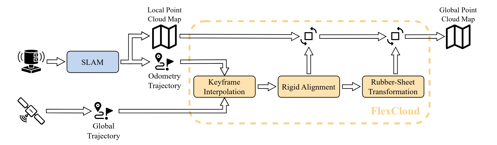

<div align="center">

<h1>FlexCloud</h1>

Georeferencing of Point Cloud Maps

[](https://www.linux.org/)
[](https://www.docker.com/)


</div>

<h2>Overview</h2>
This project enables the georeferencing of an existing point cloud map created only from inertial sensor data (e.g. LiDAR) by the use of the corresponding GNSS data.
Leveraging the concept of rubber-sheeting from cartography, the tool is also able to account for accumulated errors during map creation and thus rectyfy the map.



<h2>🐋 Installation</h2>

1. Clone the repository by running

```bash
git clone git@github.com:TUMFTM/FlexCloud.git
```

2. Go to the root directory of the repository

```bash
cd FlexCloud/
```

3. Build the docker image

```bash
./docker/build_docker.sh  
```

You can also download built versions of the docker images from the github container registry.
E.g. to download the latest container, run:

```bash
docker pull ghcr.io/tumftm/flexcloud:latest
```

4. Run the container and mount your data by appending the directory containing your data:

```bash
./docker/run_docker.sh /your/local/directory/data
```

Note that you have to change the image name within the script, if you downloaded the docker image from Dockerhub in the previous step.
Although installation with the provided Docker-Container is recommended, you can also install the package locally.
To do so, you first have to install the required dependencies:

* PCL
* CGAL
* GeographicLib
* Eigen3 \
If you are struggling with their installation, you can have a look at the process within the [Dockerfile](docker/Dockerfile).

<h2> 🔨 Usage</h2>

<h3> Keyframe Interpolation</h3>

* set parameters in `/config/select_keyframes.yaml`

1. Necessary input parameters:
   * `config_path` => path to [config-file](./config/select_keyframes.yaml)
   * `pos_dir_path` => path to raw GNSS/reference trajectory of the vehicle (format: txt-file with `lat, lon, ele, lat_stddev, lon_stddev, ele_stddev` or `x, y, z, x_stddev, y_stddev, z_stddev`, if the reference trajectory is already in local coordinates)
   * `kitti_odom_path` => path to SLAM trajectory of the vehicle (KITTI-format)
   * `pcd_dir_path` => path to point cloud frames corresponding to odom trajectory
   * `dst_dir_path` => path to output trajectory

* make sure the data follows the following format/requirements:

<!-- markdownlint-disable MD013 -->
| Description | Format |
| ----------- | ----------- |
| global positions (usually from GNSS or an EKF using GNSS) | individual `.txt` files per position in a directory specify position in `xpos ypos zpos x_stddev y_stddev z_stddev`. The files are named according to the UTC-timestamp of the position in the format `sec_nanosec`. |
| inertial LiDAR trajectory (usually from a LiDAR odometry/SLAM algorithm) | single `.txt` file in KITTI-format: `r1 r2 r3 x r4 r5 r6 y r7 r8 r9 z` |
| point cloud frames corresponding to LiDAR trajectory | individual `.pcd` files per cloud in a directory. The files are named according to the UTC-timestamp of the position in the format `sec_nanosec`. |
<!-- markdownlint-enable MD013 -->

* the executable selects keyframes from the LiDAR trajectory (keyframes are based on minimum longitudinal distance
* `keyframe_delta_x` - or minimum angle - `keyframe_delta_angle`) based on the config and converts it together
with the pcd-files to a format compatible with [interactive_slam](https://github.com/koide3/interactive_slam)
* as the global positions correspond to the same tracjetory, the keyframes of the global position trajectory can be
computed in two ways (based on the parameter `interpolated`):
  * **Closest neighbor**: For each keyframe of the LiDAR trajectory, the global position frame with the
  smallest timestamp difference is selected.
  * **Spline interpolation**: For each keyframe of the LiDAR trajectory, the global position frame at the given
  timestamp is interpolated based on a third-order spline. The parameter `interp_pos_delta_xyz` is used to select
  two positions that are next to each other but have a minimum euclidean distance of that parameter.
  `stddev_threshold` is used to sort out global positions that have a high covariance.

* to run the keyframe interpolation, simply execute the executable with the necessary data and config as arguments:

```bash
./select_keyframes <config_path> <pos_dir_path> <kitti_odom_path> <pcd_dir_path> <dst_dir_path>
```

* the output of the Keyframe Interpolation is designed to be compatible with [interactive_slam](https://github.com/koide3/interactive_slam).
* This enables the additional insertion of loop closures before applying the georeferencing step.

<h3> PCD Georeferencing</h3>
* set parameters in `/config/pcd_georef.yaml`

1. Necessary input parameters:
   * `config_path` => path to [config-file](./config/pcd_georef.yaml)
   * `traj_path` => path to GNSS/reference trajectory of the vehicle (format: single txt-file with `lat, lon, ele, lat_stddev, lon_stddev, ele_stddev` or `x, y, z, x_stddev, y_stddev, z_stddev`, if the reference trajectory is already in local coordinates)
   * `poses_path` => path to SLAM trajectory of the vehicle (KITTI-format)
   * `pcd_path` => path to point cloud map corresponding to poses trajectory (OPTIONAL - only if `transform_pcd` set)
   * `pcd_out_path` => path to save the final, georeferenced point cloud map (OPTIONAL - only if `transform_pcd` set - DEFAULT: /pcd_map_georef.pcd)

2. Start the package

   ```bash
   Usage: ./build/pcd_georef <config_path> <reference_path> <slam_path> <(optional) pcd_path> <(optional) pcd_out_path>
   ```

   To use the provided test data (only trajectories, no application on point cloud map -> set parameter `transform_pcd` to `false`)

   ```bash
   cd flexcloud/
   ./build/pcd_georef src/flexcloud/config/pcd_georef.yaml src/flexcloud/test/poseData.txt src/flexcloud/test/poses_map.txt 
   ```

3. Inspect results
   * results of the rubber-sheet transformation & the resulting, transformed point cloud map are visualized in [Rerun](https://rerun.io/).
   * by default, the rerun viewer instance of the docker container is spawned. However, if you have problems with the viewer and your graphics drivers, you can also launch your viewer locally
   * adjust the parameters if the results are satisfying
   * see table for explanation of single topics
   * follow the instructions below (Content->Analysis) to get a quantitative evaluation fo the georeferencing
   * the results are automatically saved in the current working directory within the folder `output/traj_matching/`
   * Quick usage (the directory output/traj_matching is automatically generated at the current working directory):

   ```bash
       python3 plot_traj_matching.py /path/to/output/traj_matching/
   ```

| Type | Description |
| ----------- | ----------- |
| `Trajectory` | reference trajectory |
| `Trajectory_SLAM` | original SLAM trajectory |
| `Trajectory_align` | SLAM trajectory aligned to reference with [Umeyama](https://web.stanford.edu/class/cs273/refs/umeyama.pdf) transformation |
| `Trajectory_RS` | SLAM trajectory after [rubber-sheet](https://www.tandfonline.com/doi/abs/10.1559/152304085783915135)-transformation |
| `control_points` | control points used for rubber-sheeting |
| `tetrahedra` | triangulation used for rubber-sheeting |
| `pcd_map` | transformed point cloud map |

* Inspect results and modify parameters if desired.

<h2>📄 Content</h2>

Detailed documentation of the modules can be found below.

<details>
<summary> <h3> Trajectory Matching </h3> </summary>

* calculation of transformation based on GNSS/reference and SLAM trajectories
* trajectories do not have to be time-synchronized, although time-synchronization is required to select control points automatically for rubber-sheeting

<h4>1. Projection of Global Coordinates</h4>

* global coordinates may be projected into local coordinate system using ENU-coordinates from the [GeographicLib](https://geographiclib.sourceforge.io/2009-03/classGeographicLib_1_1LocalCartesian.html)

<h4>2. Keyframe Interpolation</h4>
- based on: <https://github.com/koide3/interactive_slam/blob/master/src/odometry2graph.cpp>
- Selection of keyframes and interpolation of global position frames for map creation and manual optimization
- Interpolation follows a third-order spline interpolation from [Eigen](https://eigen.tuxfamily.org/dox/unsupported/group__Splines__Module.html)

<h4>3. Alignment of Trajectories by Rigid Transformation</h4>

* SLAM trajectory aligned to reference using [Umeyama algorithm](https://web.stanford.edu/class/cs273/refs/umeyama.pdf) transformation in 2D/3D
* application of calculated transformation on SLAM trajectory
* screenshot below shows results of alignment of SLAM trajectory to projected reference trajectory with [Umeyama algorithm](https://web.stanford.edu/class/cs273/refs/umeyama.pdf)\
  

<h4>4. Rubber-Sheet transformation</h4>

* piecewise linear rubber-sheet transformation in 2D/3D based on concept of [Griffin & White](https://www.tandfonline.com/doi/abs/10.1559/152304085783915135)
* using Delaunay triangulation from [CGAL](https://www.cgal.org/)
* manual selection of control points in RVIZ (see above) possible if trajectories are not time-synchronized (parameter `auto_cp`)
* automatic exclusion of trajectory points as control points using thresholding for standard deviation possible
* manual exclusion of indices as controlpoints and manual displacement in xy possible, see parameter descriptions
* application of calculated transformations on target SLAM-poses and point cloud map
* the two screenshots below show selected control points on the aligned trajectories from step 2 and the results of the rubber-sheet transformation\
   

</details>
<details>
<summary> <h3> Evaluation </h3> </summary>

* export of various data by setting corresponding parameters in config-file
  * data is exported to `.txt` files that are then read by python-scripts
  * set export path in config-file
  * adjust import paths at the beginning of python-scripts if necessary
* analysis scripts in `/analysis`:
  * visualization of initial trajectories, [Umeyama transformation](https://web.stanford.edu/class/cs273/refs/umeyama.pdf) and [Rubber-Sheet transformation](https://www.tandfonline.com/doi/abs/10.1559/152304085783915135)
  * execute script `plot_traj_matching.py` in `/analysis`
  * produces graphs shown in previous section
  * calculation of deviation between trajectories based on euclidean distance of points

</details>

<h2>📈 Test Data </h2>

The data was recorded by the [TUM Autonomous Motorsport Team](https://www.mos.ed.tum.de/ftm/forschungsfelder/team-av-perception/tum-autonomous-motorsport/) during the [Abu Dhabi Autonomous Racing League](https://a2rl.io/) 2024.
The SLAM trajectory is created using [KISS-ICP](https://github.com/PRBonn/kiss-icp) in combination with [Interactive SLAM](https://github.com/SMRT-AIST/interactive_slam).
The reference trajectory presents post-processed data from the RTK-corrected GNSS-signal of the vehicle.

<h2>📇 Developers </h2>

* [Maximilian Leitenstern](mailto:maxi.leitenstern@tum.de),
Institute of Automotive Technology,
School of Engineering and Design,
Technical University of Munich,
85748 Garching,
Germany
* Marko Alten (student research project)
* Christian Bolea-Schaser (student research project)

<h2>📃 Citation </h2>

If you use this repository for any academic work, please consider citing our paper (preprint):

```bibtex
@misc{leitenstern2025flexcloud,
      title={FlexCloud: Direct, Modular Georeferencing and Drift-Correction of Point Cloud Maps}, 
      author={Maximilian Leitenstern and Marko Alten and Christian Bolea-Schaser and Dominik Kulmer and Marcel Weinmann and Markus Lienkamp},
      year={2025},
      eprint={2502.00395},
      archivePrefix={arXiv},
      primaryClass={cs.RO},
      url={https://arxiv.org/abs/2502.00395}, 
}
```
