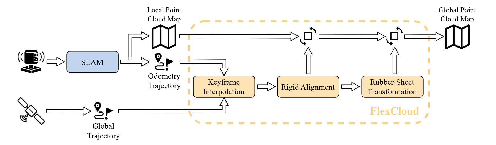
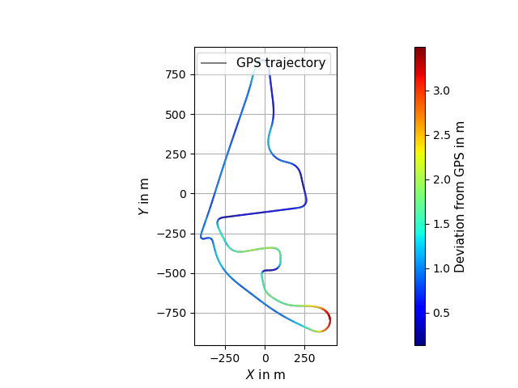
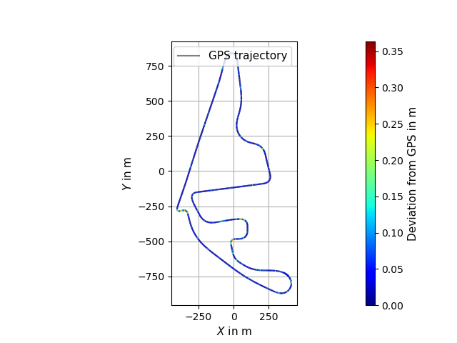
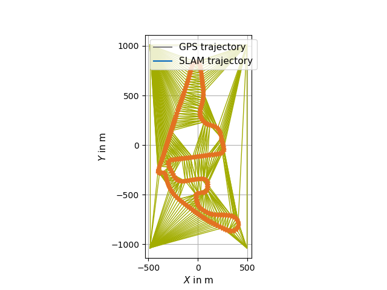

<div align="center">

<h1>FlexCloud</h1>

Georeferencing of Point Cloud Maps

[](https://www.linux.org/)
[](https://www.docker.com/)


[](https://arxiv.org/abs/2502.00395)
[](https://doi.org/10.5220/0013359600003941)


</div>

<h2>Overview</h2>
This project enables the georeferencing of an existing point cloud map created only from inertial sensor data (e.g. LiDAR) by the use of the corresponding GNSS data.
Leveraging the concept of rubber-sheeting from cartography, the tool is also able to account for accumulated errors during map creation and thus rectify the map.



<h2>📦 Installation via PyPI</h2>

The simplest way to use FlexCloud is via the PyPI wheel — it bundles the C++ executables together with the ROS 2 runtime libraries they need, so you don't need a system ROS installation.

```bash
pip install flexcloud
flexcloud-keyframe-interpolation --help
flexcloud-georeferencing --help
```

The wheel ships with `flexcloud-keyframe-interpolation` and `flexcloud-georeferencing` console-scripts; both accept the CLI flags documented below.

<h2>🐋 Installation via Docker</h2>

1. Clone the repository by running

```bash
git clone git@github.com:TUMFTM/FlexCloud.git
```

2. Go to the root directory of the repository

```bash
cd FlexCloud/
```

3. Build the docker image

```bash
./docker/build_docker.sh  
```

You can also download built versions of the docker images from the github container registry.
E.g. to download the latest container, run:

```bash
docker pull ghcr.io/tumftm/flexcloud:latest
```

4. Run the container and mount your data by appending the directory containing your data:

```bash
./docker/run_docker.sh /your/local/directory/data
```

Note that you have to change the image name within the script, if you downloaded the docker image from Dockerhub in the previous step.
Although installation with the provided Docker-Container is recommended, you can also install the package locally.
To do so, you first have to install the required dependencies:

* PCL
* CGAL
* GeographicLib
* Eigen3 \
If you are struggling with their installation, you can have a look at the process within the [Dockerfile](docker/Dockerfile).

<h2> 🔨 Usage</h2>

<h3> Keyframe Interpolation</h3>

All algorithm parameters are CLI flags with reasonable defaults. Invoke either via the PyPI wheel (`flexcloud-keyframe-interpolation`) or, if the package is built from source as a colcon package, via `ros2 run flexcloud keyframe_interpolation`.

The reference data (global positions of the vehicle) can be supplied either as a directory of per-position `.txt` files (legacy format) or directly from a ROS 2 bag (`.mcap` or `sqlite3`) that contains `sensor_msgs/msg/NavSatFix` or `nav_msgs/msg/Odometry` messages.

```text
flexcloud-keyframe-interpolation [OPTIONS] <poses-path> [out-dir]

Required positional arguments:
  poses-path      SLAM trajectory in KITTI format
                  (one row per pose: stamp xpos ypos zpos xquat yquat zquat wquat)
  out-dir         Output directory for poses_keyframes.txt and positions_interpolated.txt
                  (defaults to the current directory)

Reference data (one of --pos-dir or --pos-bag is required):
  --pos-dir TEXT             Directory with per-position txt files
                             (filenames named <sec>_<nanosec>.txt, content
                             "x y z x_stddev y_stddev z_stddev")
  --pos-bag TEXT             ROS 2 bag containing the reference messages
  --pos-topic TEXT           Topic of NavSatFix or Odometry messages (required with --pos-bag)
  -t,--target-frame TEXT     TF frame to transform positions into (uses /tf and /tf_static
                             from the bag). Optional.
  --origin LAT LON ALT       Custom origin for NavSatFix → local Cartesian projection.
                             If omitted the first valid fix is used.
```

Examples:

```bash
# legacy: per-position txt files (output to current directory)
flexcloud-keyframe-interpolation /path/to/poses_kitti.txt \
    --pos-dir /path/to/positions/

# rosbag with NavSatFix on /sensor/gnss/fix
flexcloud-keyframe-interpolation /path/to/poses_kitti.txt /path/to/out \
    --pos-bag /path/to/bag.mcap --pos-topic /sensor/gnss/fix \
    --target-frame base_link

# rosbag with Odometry
flexcloud-keyframe-interpolation /path/to/poses_kitti.txt /path/to/out \
    --pos-bag /path/to/bag.mcap --pos-topic /odom \
    --target-frame base_link
```

Notes on bag input:
* `NavSatFix` messages are projected to local Cartesian via [GeographicLib](https://geographiclib.sourceforge.io/2009-03/classGeographicLib_1_1LocalCartesian.html); standard deviations are taken from `position_covariance` (diagonal).
* `Odometry` messages use `pose.pose` directly; standard deviations are taken from `pose.covariance` (diagonal).
* When `--target-frame` is set, all `/tf` and `/tf_static` messages from the bag are pre-loaded into a TF buffer. For each message we then look up the **translation from the static** transform (the lever arm between the message's frame and the target frame) and the **orientation from the dynamic** transform at the message timestamp, and apply `rotation * static_translation` as the world-frame offset to the message position. This mirrors the behaviour of `rosbag_to_gnss` from `iac_map_loc`.

The keyframe-selection algorithm itself is unchanged:
* keyframes are selected from the LiDAR trajectory based on minimum longitudinal distance (`keyframe_delta_x`) or minimum angular delta (`keyframe_delta_angle`).
* For each LiDAR keyframe, the corresponding reference position is computed in one of two ways (controlled by `interpolate`):
  * **Closest neighbor** — pick the reference frame with the smallest timestamp delta.
  * **Spline interpolation** — fit a third-order spline through neighboring reference points (selected so that consecutive supports have a minimum euclidean distance of `interp_pos_delta_xyz`) and evaluate at the keyframe timestamp.
* `stddev_threshold` is used to drop reference frames with high covariance.

The output is designed to be compatible with the georeferencing executable.

<h3> PCD Georeferencing</h3>

All parameters are CLI flags with sensible defaults; the only YAML config that remains is for the index-based fine-tuning arrays (`exclude_ind`, `shift_ind`, `shift_ind_dist`, `fake_ind`, `fake_ind_dist`, `fake_ind_height`) and is supplied via `--config-file`.

```text
flexcloud-georeferencing [OPTIONS] <positions-path> <poses-path>

Required positional arguments:
  positions-path        GNSS / reference trajectory (lat,lon,ele,*_stddev or
                        x,y,z,*_stddev if already cartesian)
  poses-path            SLAM trajectory in KITTI format

Inputs:
  --pcd PATH            Point cloud map to transform
  --config-file PATH    Optional YAML for index-based fine-tuning arrays

Trajectory matching:
  --transform-traj / --no-transform-traj   (default: --no-transform-traj)
  --rs-num-control-points INT              (default: 10)
  --stddev-threshold FLOAT                 (default: 0.05)
  --square-size FLOAT FLOAT FLOAT          (default: 0.1 0.1 10.0)

Pointcloud transformation:
  --num-cores INT                          (default: 10)
  --include-labels / --no-include-labels   (default: --include-labels)

Origin:
  --custom-origin / --no-custom-origin     (default: --no-custom-origin)
  --origin LAT LON ALT                     (default: 0.0 0.0 0.0)
```

Examples:

```bash
# defaults, cartesian reference, no point cloud
flexcloud-georeferencing positions_interpolated.txt poses_keyframes.txt

# transform a GPS trajectory and a point cloud, with a custom origin
flexcloud-georeferencing reference.txt poses_keyframes.txt \
    --pcd map.pcd --transform-traj --custom-origin --origin 48.262 11.667 0.0

# supply index-based fine-tuning arrays via YAML
flexcloud-georeferencing reference.txt poses_keyframes.txt \
    --config-file config/georeferencing.yaml
```

Inspect results:

* results of the rubber-sheet transformation & the resulting, transformed point cloud map are visualized in [Rerun](https://rerun.io/).
* by default, the rerun viewer instance of the docker container is spawned. However, if you have problems with the viewer and your graphics drivers, you can also launch your viewer locally
* adjust the parameters if the results are satisfying
* see table for explanation of single topics
* follow the instructions below (Content->Analysis) to get a quantitative evaluation fo the georeferencing
* the results are automatically saved in the current working directory within the folder `output/traj_matching/`
* Quick usage (the directory output/traj_matching is automatically generated at the current working directory):

```bash
python3 plot_traj_matching.py /path/to/output/traj_matching/
```

| Type | Description |
| ----------- | ----------- |
| `Trajectory` | reference trajectory |
| `Trajectory_SLAM` | original SLAM trajectory |
| `Trajectory_align` | SLAM trajectory aligned to reference with [Umeyama](https://web.stanford.edu/class/cs273/refs/umeyama.pdf) transformation |
| `Trajectory_RS` | SLAM trajectory after [rubber-sheet](https://www.tandfonline.com/doi/abs/10.1559/152304085783915135)-transformation |
| `control_points` | control points used for rubber-sheeting |
| `tetrahedra` | triangulation used for rubber-sheeting |
| `pcd_map` | transformed point cloud map |

* Inspect results and modify parameters if desired.

<h2>📄 Content</h2>

Detailed documentation of the modules can be found below.

<details>
<summary> <h3> Trajectory Matching </h3> </summary>

* calculation of transformation based on GNSS/reference and SLAM trajectories
* trajectories do not have to be time-synchronized, although time-synchronization is required to select control points automatically for rubber-sheeting

<h4>1. Projection of Global Coordinates</h4>

* global coordinates may be projected into local coordinate system using ENU-coordinates from the [GeographicLib](https://geographiclib.sourceforge.io/2009-03/classGeographicLib_1_1LocalCartesian.html)

<h4>2. Keyframe Interpolation</h4>
- Selection of keyframes and interpolation of global position frames for map creation and manual optimization
- Interpolation follows a third-order spline interpolation from [Eigen](https://eigen.tuxfamily.org/dox/unsupported/group__Splines__Module.html)

<h4>3. Alignment of Trajectories by Rigid Transformation</h4>

* SLAM trajectory aligned to reference using [Umeyama algorithm](https://web.stanford.edu/class/cs273/refs/umeyama.pdf) transformation in 2D/3D
* application of calculated transformation on SLAM trajectory
* screenshot below shows results of alignment of SLAM trajectory to projected reference trajectory with [Umeyama algorithm](https://web.stanford.edu/class/cs273/refs/umeyama.pdf)\
  

<h4>4. Rubber-Sheet transformation</h4>

* piecewise linear rubber-sheet transformation in 2D/3D based on concept of [Griffin & White](https://www.tandfonline.com/doi/abs/10.1559/152304085783915135)
* using Delaunay triangulation from [CGAL](https://www.cgal.org/)
* manual selection of control points in RVIZ (see above) possible if trajectories are not time-synchronized (parameter `auto_cp`)
* automatic exclusion of trajectory points as control points using thresholding for standard deviation possible
* manual exclusion of indices as controlpoints and manual displacement in xy possible, see parameter descriptions
* application of calculated transformations on target SLAM-poses and point cloud map
* the two screenshots below show selected control points on the aligned trajectories from step 2 and the results of the rubber-sheet transformation\
   

</details>
<details>
<summary> <h3> Evaluation </h3> </summary>

* export of various data by setting corresponding parameters in config-file
  * data is exported to `.txt` files that are then read by python-scripts
  * set export path in config-file
  * adjust import paths at the beginning of python-scripts if necessary
* analysis scripts in `/analysis`:
  * visualization of initial trajectories, [Umeyama transformation](https://web.stanford.edu/class/cs273/refs/umeyama.pdf) and [Rubber-Sheet transformation](https://www.tandfonline.com/doi/abs/10.1559/152304085783915135)
  * execute script `plot_traj_matching.py` in `/analysis`
  * produces graphs shown in previous section
  * calculation of deviation between trajectories based on euclidean distance of points

</details>

<h2>📈 Test Data </h2>

The data was recorded by the [TUM Autonomous Motorsport Team](https://www.mos.ed.tum.de/ftm/forschungsfelder/team-av-perception/tum-autonomous-motorsport/) during the [Abu Dhabi Autonomous Racing League](https://a2rl.io/) 2025.
The LiDAR/SLAM trajectory is created using [glim](https://github.com/koide3/glim).
The reference trajectory presents raw data from the RTK-corrected GNSS-signal of the vehicle.

<h2>📇 Developers </h2>

* [Maximilian Leitenstern](mailto:maxi.leitenstern@tum.de),
Institute of Automotive Technology,
School of Engineering and Design,
Technical University of Munich,
85748 Garching,
Germany
* Marko Alten (student research project)
* Christian Bolea-Schaser (student research project)

<h2>📃 Citation </h2>

If you use this repository for any academic work, please consider citing our paper (preprint):

```bibtex
@misc{leitenstern2025flexcloud,
      title={FlexCloud: Direct, Modular Georeferencing and Drift-Correction of Point Cloud Maps}, 
      author={Maximilian Leitenstern and Marko Alten and Christian Bolea-Schaser and Dominik Kulmer and Marcel Weinmann and Markus Lienkamp},
      year={2025},
      eprint={2502.00395},
      archivePrefix={arXiv},
      primaryClass={cs.RO},
      url={https://arxiv.org/abs/2502.00395}, 
}
```
