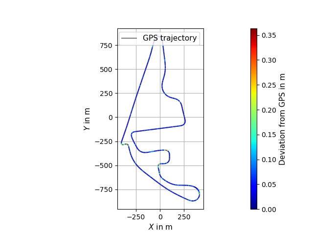

# Geometric Alignment

- calculation of transformation based on GNSS and SLAM trajectories
- trajectories do not have to be time-synchronized

## 1. Projection of global coordinates

- GNSS trajectory projected into local coordinate system using ENU-coordinates from the [GeographicLib](https://geographiclib.sourceforge.io/2009-03/classGeographicLib_1_1LocalCartesian.html)
- origin of grid for projection set based on config file otherwise first GNSS point

## 2. Alignment of trajectories by rigid transformation

- SLAM trajectory aligned to GPS using [Umeyama algorithm](https://web.stanford.edu/class/cs273/refs/umeyama.pdf) transformation in 2D/3D
- application of calculated transformation on SLAM trajectory
- screenshot below shows results of alignment of SLAM trajectory to projected GNSS trajectory with [Umeyama algorithm](https://web.stanford.edu/class/cs273/refs/umeyama.pdf)\
  

## 3. Rubber-Sheet transformation

- piecewise linear rubber-sheet transformation in 2D/3D based on [Griffin & White](https://www.tandfonline.com/doi/abs/10.1559/152304085783915135)
- using Delaunay triangulation from [CGAL](https://www.cgal.org/)
- manual selection of control points in RVIZ (see main documentation)
- automatic selection using thresholding for GNSS-standard deviation possible if trajectories are time-synchronized
- manual exclusion of indices as controlpoints and manual displacement in xy possible
- application of calculated transformation on target SLAM-poses and point cloud map
- the two screenshots below show selected control points on the aligned trajectories from step 2 and the results of the rubber-sheet transformation\
   
