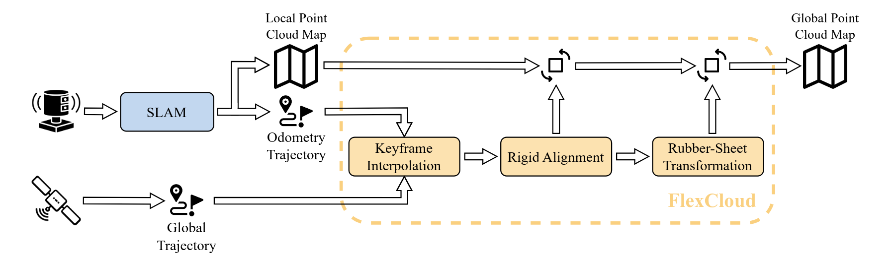
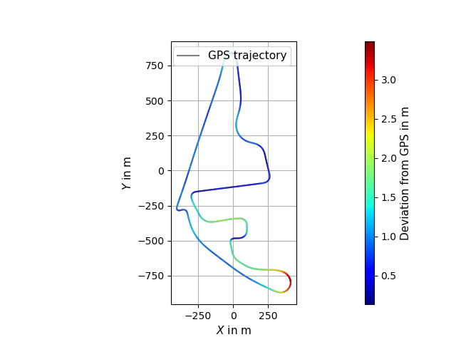
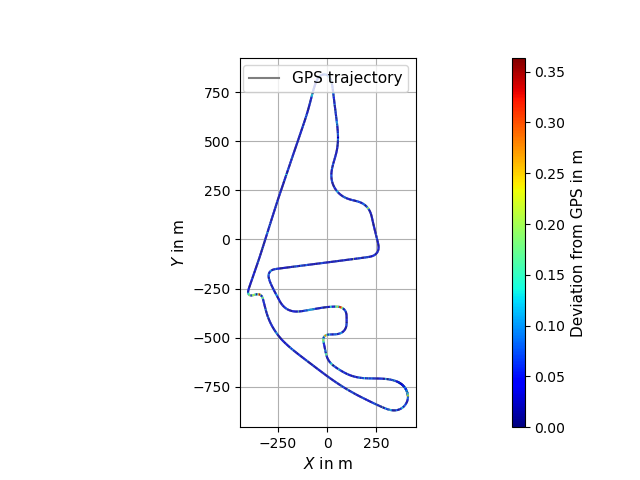
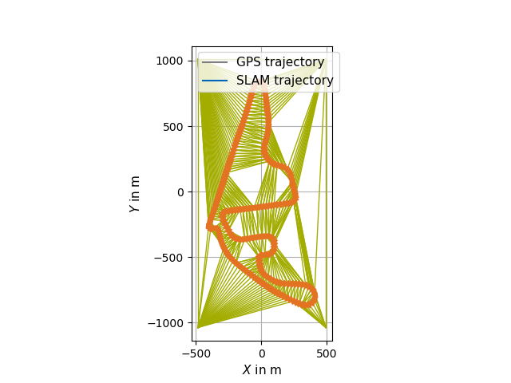

# Functionality & References

FlexCloud georeferences a SLAM-built point cloud map by aligning its trajectory to a
GNSS / reference trajectory and rectifying the map accordingly. The pipeline is split into two stages: **trajectory matching** and **evaluation**.



## Trajectory Matching

The transformation is computed from a pair of trajectories — a GNSS/reference
trajectory and a SLAM trajectory. The trajectories **do** need to be
time-synchronized. However, it is not required that they are triggered.

### 1. Projection of global coordinates (Keyframe Interpolation / Georeferencing)

Global coordinates may be projected into a local ENU coordinate system via
[GeographicLib](https://geographiclib.sourceforge.io/2009-03/classGeographicLib_1_1LocalCartesian.html).

### 2. Keyframe interpolation

- Keyframes are selected from the SLAM trajectory and matching reference positions
  are interpolated.
- Interpolation uses a third-order spline implementation from
  [Eigen](https://eigen.tuxfamily.org/dox/unsupported/group__Splines__Module.html).

### 3. Rigid alignment (Georeferencing)

The SLAM trajectory is aligned to the reference using the
[Umeyama algorithm](https://web.stanford.edu/class/cs273/refs/umeyama.pdf) and the transformation is applied to the full SLAM trajectory.



### 4. Rubber-sheet transformation (Georeferencing)

A piecewise linear rubber-sheet transformation, based on the concept of
[Griffin & White](https://www.tandfonline.com/doi/abs/10.1559/152304085783915135) and using Delaunay triangulation from [CGAL](https://www.cgal.org/), corrects accumulated drift in 3D:

- Control points can be excluded automatically via standard-deviation thresholding.
- Indices can be excluded manually and displaced in xy via CLI / YAML parameters.
- The computed transformation is applied to both the SLAM poses and the point cloud
  map.




## Evaluation (Georeferencing)

Pass `--evaluation` to `flexcloud-georeferencing` to:

- Print RMSE, mean, median, stddev, min and max of the per-point euclidean deviation
  between the reference trajectory and both the Umeyama-aligned and the
  rubber-sheeted SLAM trajectory (single side-by-side table in the terminal).
- Visualise per-segment deviations in the Rerun viewer as two extra jet-colormap-shaded
  linestrings: `Trajectory_align_deviation` and `Trajectory_RS_deviation` (segment
  label = deviation in meters).

## References

If you use FlexCloud in academic work, please cite the preprint:

```bibtex
@conference{leitenstern2025flexcloud,
author={Maximilian Leitenstern and Marko Alten and Christian Bolea-Schaser and Dominik Kulmer and Marcel Weinmann and Markus Lienkamp},
title={FlexCloud: Direct, Modular Georeferencing and Drift-Correction of Point Cloud Maps},
booktitle={Proceedings of the 11th International Conference on Vehicle Technology and Intelligent Transport Systems - Volume 1: VEHITS},
year={2025},
pages={157-165},
publisher={SciTePress},
organization={INSTICC},
doi={10.5220/0013359600003941},
isbn={978-989-758-745-0},
}
```

- Preprint on arXiv — <https://arxiv.org/abs/2502.00395>
- Published version (DOI) — <https://doi.org/10.5220/0013359600003941>

### Background literature

- Umeyama, S. *Least-Squares Estimation of Transformation Parameters Between Two
  Point Patterns.* IEEE TPAMI, 1991.
  [PDF](https://web.stanford.edu/class/cs273/refs/umeyama.pdf)
- Griffin, P. F. & White, M. *Piecewise linear rubber-sheet map transformations.*
  The American Cartographer, 1985.
  [Paper](https://www.tandfonline.com/doi/abs/10.1559/152304085783915135)
- GeographicLib —
  <https://geographiclib.sourceforge.io/2009-03/classGeographicLib_1_1LocalCartesian.html>
- CGAL — <https://www.cgal.org/>

## Developers

- [Maximilian Leitenstern](mailto:maxi.leitenstern@tum.de),
  Institute of Automotive Technology, School of Engineering and Design,
  Technical University of Munich, 85748 Garching, Germany
- Marko Alten (student research project)
- Christian Bolea-Schaser (student research project)
