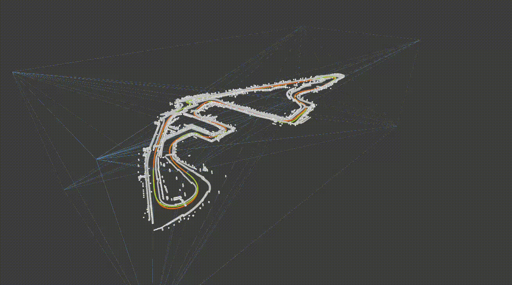

# Test Data & Visualization

A reference dataset is provided so you can verify a fresh install and
explore the visual output in [Rerun](https://rerun.io/).

## Dataset

The data was recorded by the
[TUM Autonomous Motorsport Team](https://www.mos.ed.tum.de/ftm/forschungsfelder/team-av-perception/tum-autonomous-motorsport/)
during the [Abu Dhabi Autonomous Racing League](https://a2rl.io/) 2025.
It enables testing the `georeferencing` executable.

- **LiDAR / SLAM trajectory** — created with [glim](https://github.com/koide3/glim).
- **Reference trajectory** — raw data from the RTK-corrected GNSS signal of the vehicle.

## Visualising results in Rerun

- Results of the rubber-sheet transformation and the resulting, transformed point cloud
  map are streamed live to [Rerun](https://rerun.io/).
- By default the Rerun viewer instance inside the Docker container is spawned.
  If you have issues with the viewer and your graphics drivers, launch a Rerun viewer
  locally instead — FlexCloud will connect to it automatically.
- Adjust the algorithm parameters (see [Usage](usage.md)) if results are unsatisfactory.

### Entity legend

| Entity | Description |
| --- | --- |
| `Trajectory` | reference trajectory |
| `Trajectory_SLAM` | original SLAM trajectory |
| `Trajectory_align` | SLAM trajectory aligned rigidly to reference |
| `Trajectory_RS` | SLAM trajectory after rubber-sheet transformation |
| `Trajectory_align_deviation` | aligned trajectory, per-segment colored by euclidean deviation from the reference (only with `--evaluation`) |
| `Trajectory_RS_deviation` | rubber-sheeted trajectory, per-segment colored by euclidean deviation from the reference (only with `--evaluation`) |
| `control_points` | control points used for rubber-sheeting |
| `tetrahedra` | triangulation used for rubber-sheeting |
| `pcd_map` | transformed point cloud map |

### Example output

